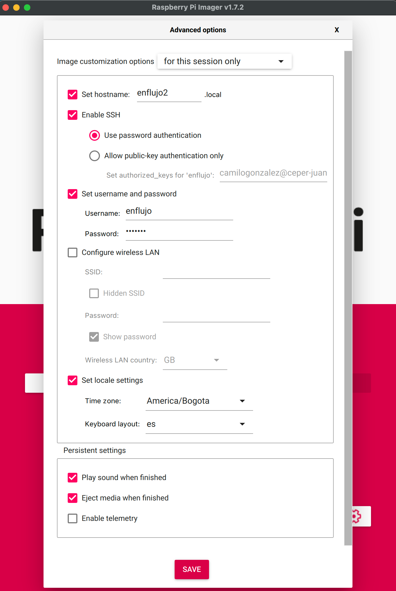

# Cluster de Raspberry Pi

## Equipos

- Cuatro Raspberry Pi 4.
- Cluster case
- Cuatro USB C
- Disipadores
- Ventiladores.
- Cuatro memorias SD 32GB ScanDisk Ultra serie 10.

## Preparar las memorias SD

Descargar [Raspberry Pi Imager](https://www.raspberrypi.com/software/).

- OS: Raspberry Pi OS Lite (64-bit)

### Activar SSH y nombrar el nodo

- En "Set hostname:" darle un nombre específico al nodo (cada Raspberry va a ser un nodo en el cluster).
  - La convención acá va a ser: `enflujo1.local`, `enflujo2.local`, `enflujo3.local`, etc.
- Activar SSH.
- Crear nombre de usuario y contraseña. Estos los usamos luego para conectarse por SSH.
- (opcional) Configurar el WiFi donde SSID es el nombre de la red.



## Configurar la Raspberry

Poner la memoria SD a la Raspberry y conectarla a corriente. Esperar un momento mientras carga.

```bash
ssh enflujo@enflujo1.local
```

Inicialmente no estamos haciendo cambios a la configuración general, pero para hacerlo:

```bash
sudo raspi-config
```

## ZSH

Para tener un terminal más cómodo.

Actualizar dependencias:

```bash
sudo apt update
```

```bash
sudo apt dist-upgrade --yes
```

Instalar zsh:

```bash
sudo apt install zsh --yes
```

Definir como SHELL predeterminado:

```bash
chsh -s $(which zsh)
```

Salir:

```bash
exit
```

volver a entrar:

```bash
ssh enflujo@enflujo1.local
```

Al reiniciar debe configurarse el zsh. Para ello hay dos opciones:

1. Escribir en el terminal zsh y luego escoger la opción (2).

2. Al entrar de nuevo escoger la opción (2) si el menú de opciones aparece automáticamente

> (2) Populate your ~/.zshrc with the configuration recommended
> by the system administrator and exit (you will need to edit
> the file by hand, if so desired).

```bash
2
```

### Instalar Oh-My ZSH

Instalar git

```bash
sudo apt install git --yes
```

```sh (para correr este comando debe estar instalado curl)
sh -c "$(curl -fsSL https://raw.github.com/ohmyzsh/ohmyzsh/master/tools/install.sh)"
```

### Plugins del ZSH

**zsh-autosuggestions**

```bash
git clone https://github.com/zsh-users/zsh-autosuggestions ${ZSH_CUSTOM:-~/.oh-my-zsh/custom}/plugins/zsh-autosuggestions
```

**zsh fast syntax highlighting**

```bash
git clone https://github.com/zdharma-continuum/fast-syntax-highlighting.git \
  ${ZSH_CUSTOM:-$HOME/.oh-my-zsh/custom}/plugins/fast-syntax-highlighting
```

**Powerlevel10k**

1. Instalar las fuentes:

   [MesloLGS NF Regular.ttf](https://github.com/romkatv/powerlevel10k-media/raw/master/MesloLGS%20NF%20Regular.ttf)
   [MesloLGS NF Bold.ttf](https://github.com/romkatv/powerlevel10k-media/raw/master/MesloLGS%20NF%20Bold.ttf)
   [MesloLGS NF Italic.ttf](https://github.com/romkatv/powerlevel10k-media/raw/master/MesloLGS%20NF%20Italic.ttf)
   [MesloLGS NF Bold Italic.ttf](https://github.com/romkatv/powerlevel10k-media/raw/master/MesloLGS%20NF%20Bold%20Italic.ttf)

2. Escoger las fuentes desde el terminal. Abrir Terminal → Preferencias y escoger el profile predeterminado. Escoger luego `custom fonts` (activarlo si aun no lo está) y escoger `MesloLGS NF Regular`.

Hacer lo siguiente para configurar las fuentes en VS Code:

Abrir File → Preferences → Settings (PC) o Code → Preferences → Settings (Mac), escribir `terminal.integrated.fontFamily` en la caja de búsqueda y poner el nombre de la fuente: `MesloLGS NF`. Para ver los cambios es necesario reiniciar VS Code.

3. Instalar el tema en sí mismo:

3.a. Clonar el repositorio:

```bash
git clone --depth=1 https://github.com/romkatv/powerlevel10k.git ${ZSH_CUSTOM:-$HOME/.oh-my-zsh/custom}/themes/powerlevel10k
```

3.b. Poner el tema dentro del archivo `~/.zshrc` (para abrir este archivo seguir las instrucciones abajo "Activar estos plugins")

```bash
ZSH_THEME="powerlevel10k/powerlevel10k"
```

4. Reiniciar zsh

```bash
exec zsh
```

5. Configurar el tema. Escribir lo siguiente en la consola si no aparece automáticamente:

```bash
p10k configure
```

## Activar los plugins:

```bash
sudo nano ~/.zshrc
```

Con el teclado, presionar la fecha de abajo hasta la línea que dice `plugins=(git)` y sumar los plugins que acabamos de descargar:

```bash
plugins=(git zsh-autosuggestions fast-syntax-highlighting)
```

Para [actualizar Oh My ZSH automáticamente](https://github.com/ohmyzsh/ohmyzsh#getting-updates), quitar el comentario `#` en la linea.

```bash
zstyle ':omz:update' mode auto
```

Guardar los cambios con `CTRL+o`.

Salir del editor con `CTRL+x`.

Activar los cambios:

```bash
source ~/.zshrc
```

Listo, ahora al escribir en el terminar deben salir las sugerencias al escribir y usar colores que resaltan el texto.

### Configurar Git

Esta configuración es para todos los repositorios

```bash
git config --global user.name "nombre.usuario"
```

Confirmar el nombre del usuario:

```bash
git config --global user.name
```

Confirmar el email del usuario:

```bash
git config --global user.email
```

### Almacenar las credenciales de Github en el cache dentro de Git:

Tener instalado Github CLI:

Para Linux (Debian, Ubuntu Linux, Raspberry Pi OS (apt))

```bash
curl -fsSL https://cli.github.com/packages/githubcli-archive-keyring.gpg | sudo dd of=/usr/share/keyrings/githubcli-archive-keyring.gpg
```

```bash
echo "deb [arch=$(dpkg --print-architecture) signed-by=/usr/share/keyrings/githubcli-archive-keyring.gpg] https://cli.github.com/packages stable main" | sudo tee /etc/apt/sources.list.d/github-cli.list > /dev/null
```

```bash
sudo apt update
```

```bash
sudo apt install gh
```

Luego de tener esto instalado, configuramos nuestro acceso a Github:

```bash
gh auth login
```

Escogemos después la cuenta desde donde queremos loguearnos. Por lo general se escoge desde Github.com. Después escogemos el protocolo HTTPS. Luego aceptamos la autenticación con las credenciales de Github y escogemos si se realiza por medio del navegador web o por medio de un token de autenticación.

Si se escoge la autenticación por medio del navegador web es necesario ingresar el codigo que aparece en este punto de la instalación. Ingresando este código en el navegador la autenticación queda completa con este mensaje: "logged in as nombre.usuario"

### Instalar Docker usando el repositorio

Antes de instalar Docker Engine por primera vez en una nueva máquina es necesario configurar el repositorio de Docker. Luego es posible instalar y actualizar Docker desde su repositorio.

Configurar el repositorio:

Actualizar apt e instalar los paquetes para que apt pueda utilizar un repositorio sobre HTTPS

```bash
sudo apt-get update
```

```bash
sudo apt install apt-transport-https ca-certificates curl software-properties-common
```

Añadir luego la clave GPC para el repositorio oficial de Docker en el sistema

```bash
curl -fsSL https://download.docker.com/linux/ubuntu/gpg | sudo gpg --dearmor -o /usr/share/keyrings/docker-archive-keyring.gpg
```

Configurar el repositorio estable

```bash
sudo echo "deb [arch=$(dpkg --print-architecture) signed-by=/usr/share/keyrings/docker-archive-keyring.gpg] https://download.docker.com/linux/ubuntu \
  $(lsb_release -cs) stable" | sudo tee /etc/apt/sources.list.d/docker.list > /dev/null
```

### Instalar Docker Engine

```bash
sudo apt-get update
```

```bash
sudo apt-get install docker-ce docker-ce-cli containerd.io docker-compose-plugin
```

Para asegurar que la instalación fue exitosa correr el siguiente comando

```bash
sudo docker run hello-world
```

## Post-instalacion de Docker

Para evitar poner siempre en la terminal `sudo` antecediendo al comando `docker` debemos crear un grupo Unix llamado docker y agregar posteriormente los usuarios.

Pasos para crear el grupo:

1. Crear el grupo:

```bash
 sudo groupadd docker
```

2.  Agregar nuestro usuario al grupo:

```bash
 sudo usermod -aG docker $USER
```

3. Activar los cambios en el grupo:

```bash
 newgrp docker
```

4. Verificar que podemos correr docker sin sudo:

```bash
 docker run hello-world
```

### Configurar Docker para que se inicie al prender el computador
La mayoría de distribuciones de Linux (RHEL, CentOS, Fedora, Debian, Ubuntu 16.04 y superiores) usan systemd para controlar qué servicios se inician cuando se prende el computador. En Debian y Ubuntu el servicio de Docker está configurado para iniciar por defecto. Para iniciar Docker y Containerd al prender el computador en otras distribuciones se usan los siguientes comandos:

```bash
 sudo systemctl enable docker.service

 sudo systemctl enable containerd.service
```

Para desactivar este comportamiento se usa el mismo comando pero con *disable*.

```bash
 sudo systemctl disable docker.service

 sudo systemctl disable containerd.service
```

### Instalar y actualizar NVM (Node.js Version Manager)

1. Instalar curl si aún no está instalado

```bash
sudo apt install curl
```

2. Instalar nvm:

```bash
curl https://raw.githubusercontent.com/creationix/nvm/master/install.sh | bash
```

3. Aplicar los cambios para no tener que reiniciar el terminal:

```bash
source ~/.profile
```

4. Agregar el plugin nvm a la lista del archivo de oh-my-zsh

4.a. Abrir el archivo .zshrc con

```bash
nano ~/.zshrc
```

4.b. Buscar plugins=(git) y anadir nvm con espacio entre plugins

4.c. Guardar cambios con `control + O`, y luego `control + X` para salir.

4.d. Aplicar cambios con `source ~/.zshrc`,

5. Para confirmar que la instalacion fue exitosa poner en el terminal:

```bash
command -v nvm
```

La respuesta debe ser: `nvm`

### Instalar Node.js con nvm

```bash
nvm install --lts
```

### Instalar Yarn

```bash
npm i -g yarn
```

### Configurar SUDO para que no exija el password

1. Acceder al archivo /etc/sudoers

```bash
sudo visudo
```

2. Ir al final del archivo `/etc/sudoers` y agregar la siguiente linea

```bash
`suNombreDeUsuario` ALL=(ALL) NOPASSWD:ALL
```
