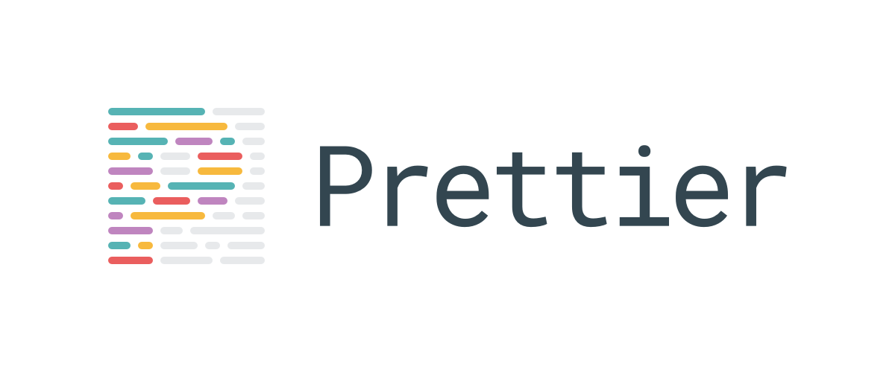

# Configuración de Prettier en VS Code

## Paso 1: Abrir preferences
- En MAC: command + shift + p 
- Windows/ Linux: control + shift + p
- Hacer click en "Preferences: Open Settings (UI)"


## Paso 2: Require Config
- Buscar: "Require config" en Preferences
- Hacer click en donde dice "Prettier: Require Config" para activar el chulito.


## Paso 3: Format On Save
- Buscar: "Format On Save" en Preferences
- Hacer click en donde dice "Format On Save" para activar el chulito.


## Paso 4: Default Formatter
- Buscar: "Formatter" en Preferences
- Hacer click en donde dice "Default formatter"
- Seleccionar la opción que dice "Prettier - Code formatter"


## Paso 5: Si estás usando Astro

### 5.1
- En MAC: command + shift + p 
- Windows/ Linux: control + shift + p
- Hacer click en "Preferences: Open User Settings (JSON)


### 5.2
- Agregar adentro del JSON:
  
```
"[astro]": {
    "editor.defaultFormatter": "astro-build.astro-vscode"
  }
```
  
